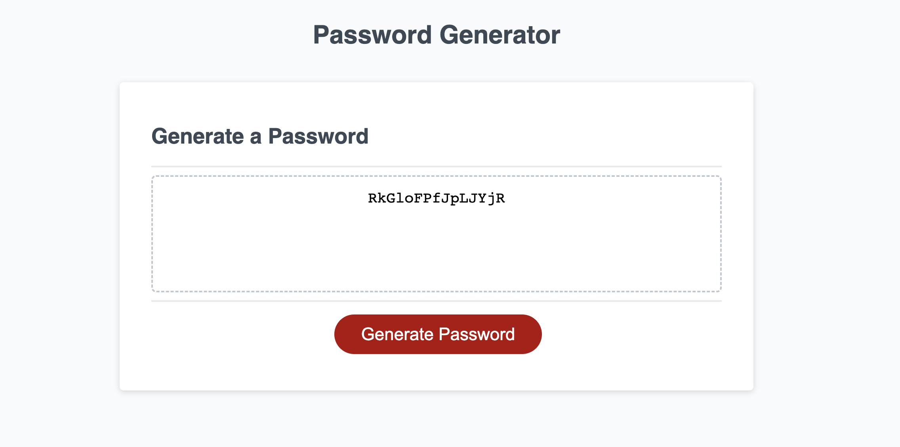

# Password Generator

### User Story

- AS AN employee with access to sensitive data
  I WANT to randomly generate a password that meets certain criteria
  SO THAT I can create a strong password that provides greater security

### Acceptance Criteria:

- Presented with a series of prompts for password criteria
- Contain selections for which criteria to include in the password
- Prompt for the length of password between 8 characters and no more than 128 characters
- Option to confirm whether or not to include lowercase, uppercase, numeric, and special characters
- Contains input that are validated and at least one character type should be selected
- Password is generated that matches selected criteria
- The password is either displayed in an alert or written to the page

[Deployed Application]()
